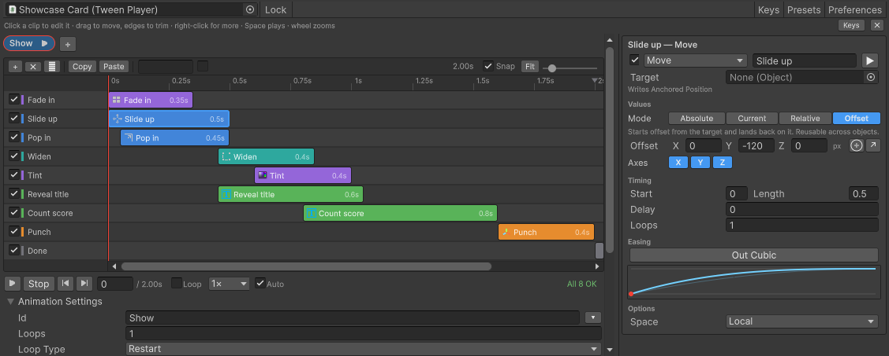

# LitMotion Tween Editor



Author, chain, preview and scrub [LitMotion](https://github.com/annulusgames/LitMotion) tween
animations from the Unity editor. You get a timeline in the inspector, exact edit-mode preview,
24 tween types, presets, and your own channels through extensions, all without writing code.

- **Current version: 0.1.1.** What changed in each version is in the
  [CHANGELOG](Assets/LitMotionTweenEditor/CHANGELOG.md).
- **Unity** 6000.6 or newer · **LitMotion** 2.0.2
- uGUI, TextMeshPro and URP support switch on by themselves when those packages are present

## Install with the Package Manager

You need [Git](https://git-scm.com/) installed and on your `PATH`. Unity's Package Manager runs
Git to fetch a Git URL package.

1. In Unity, open **Window → Package Manager**.
2. Click **+** at the top left and choose **Install package from git URL…**.
3. Enter LitMotion's URL and click **Install**:

   ```
   https://github.com/annulusgames/LitMotion.git?path=src/LitMotion/Assets/LitMotion
   ```

4. Do the same with this package's URL:

   ```
   https://github.com/MFahril/LitMotion-edit-in-inspector.git?path=Assets/LitMotionTweenEditor
   ```

**LitMotion has to go in first.** This package depends on it, but Unity cannot fetch a
dependency from a Git URL by itself. If you skip step 3, the install fails with
`com.annulusgames.lit-motion` not found.

### Or edit the manifest

Add both lines to `Packages/manifest.json` in your project:

```json
{
  "dependencies": {
    "com.annulusgames.lit-motion": "https://github.com/annulusgames/LitMotion.git?path=src/LitMotion/Assets/LitMotion",
    "com.mfahril.litmotion-tween-editor": "https://github.com/MFahril/LitMotion-edit-in-inspector.git?path=Assets/LitMotionTweenEditor"
  }
}
```

### Pinning a version

Without anything after the path, you get the latest commit on `main` at the time you install.
Unity then stays on that commit, recorded in `Packages/packages-lock.json`, until you update. To
pin a release, add its Git tag to the end of the URL:

```
https://github.com/MFahril/LitMotion-edit-in-inspector.git?path=Assets/LitMotionTweenEditor#v0.1.1
```

### Updating

**An installed copy never updates by itself.** Unity records the exact commit it installed in
`Packages/packages-lock.json` and stays on it, so your project does not change under you when
new commits are pushed here. To move to the latest version, do one of these:

- In the Package Manager, select **LitMotion Tween Editor** and click **Update**.
- If you pinned a tag, change the tag in `manifest.json`, for example `#v0.1.1` to `#v0.1.2`.
- Or delete the package's entry from `Packages/packages-lock.json`. Unity then fetches the
  latest commit the next time it resolves packages.

The version shown in the Package Manager tells you which release you are on.

### Running the package's tests in your project

Add the package to `testables` in `Packages/manifest.json`. Its EditMode and PlayMode tests then
appear in **Window → General → Test Runner**:

```json
{
  "testables": [ "com.mfahril.litmotion-tween-editor" ]
}
```

## Getting started

Add a **Tween Player** to a GameObject (**Add Component → LitMotion → Tween Player**). Add an
animation and some steps, and press Play in the preview bar.

A newly added step already does something you can see, at a modest size for its object. On a 3D
object a Move goes 1 unit and a Jump 1 forward and 0.5 high; on a UI element they go 100 and
50 pixels. Adjust from there.

Then play it from code:

```csharp
GetComponent<TweenPlayer>().Play(TweenAnimationId.Show);
```

The full guide is in the package's [README](Assets/LitMotionTweenEditor/README.md): the
quickstart, playing from code, keys, extension channels and runtime cost. Changes are in the
[CHANGELOG](Assets/LitMotionTweenEditor/CHANGELOG.md).

## This repository

This is the development project. The package is the folder
[`Assets/LitMotionTweenEditor`](Assets/LitMotionTweenEditor); that folder is all that the Git URL
installs. The rest is only for developing it:

| Path | What |
|---|---|
| `Assets/LitMotionTweenEditor` | The package: runtime, editor, presets, tests, docs |
| `Assets/LitMotionTweenEditorSamples` | A sample extension channel, the demo rig's helpers, and the player smoke test (**Tools → LitMotion → Smoke Test**) |
| `Assets/Scenes/Showcase.unity` | One UI card whose *Show* animation has nine clips across six families, plays on Play. Used for the screenshots |
| `Assets/Scenes/TestScene.unity` | **LMTE Test Rig**: hand-authored animations covering every tween type. **LMTE Defaults Rig**: 28 samples, each holding one freshly added clip, showing what a new clip of each type does on a 3D object and on UI |

How the package is built, and why, is in [ROADMAP.md](Assets/LitMotionTweenEditor/ROADMAP.md).

### Releasing a new version

Users only get changes you push, and only when they choose to update. So each release needs a
version number they can see and a tag they can pin:

1. **Run the checks.**
   - **Test Runner:** the EditMode and PlayMode tests.
   - **Tools → LitMotion → Smoke Test → Build and Run Player.** This builds a player, so it
     rewrites a few project settings files; restore them with git before committing.
2. **Raise the version** in `Assets/LitMotionTweenEditor/package.json`:
   - the last number for fixes, `0.1.1` → `0.1.2`;
   - the middle one for new features, `0.1.1` → `0.2.0`.
3. **Add a section** for that version at the top of
   [`CHANGELOG.md`](Assets/LitMotionTweenEditor/CHANGELOG.md).
4. **Commit and push** to `main`.
5. **Tag the release and push the tag**, so `#v0.1.2` works in a URL:

   ```
   git tag v0.1.2
   git push origin v0.1.2
   ```
